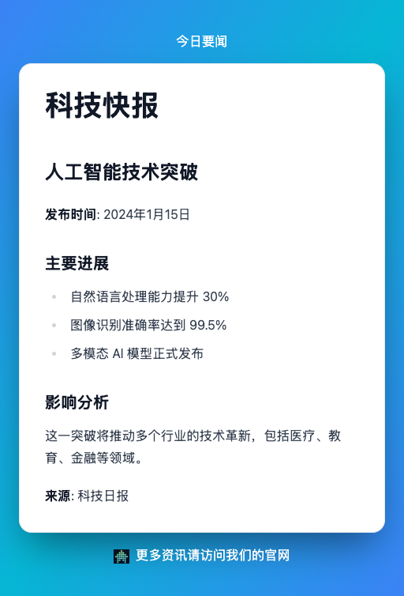
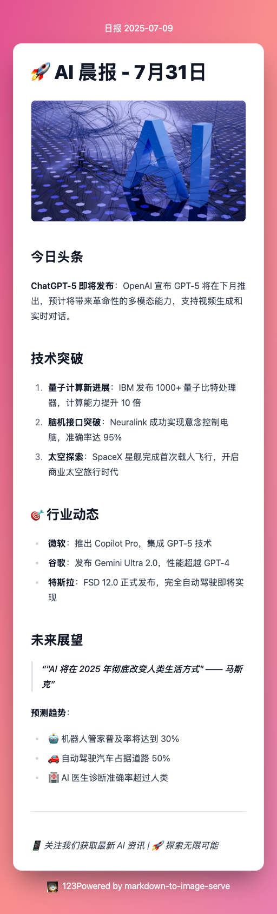
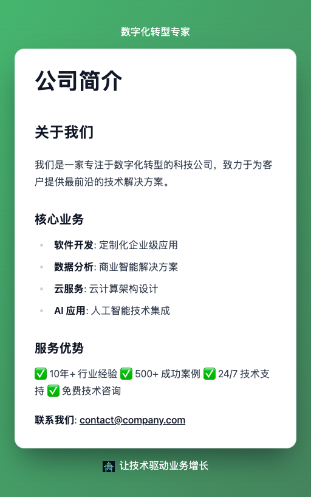

# Markdown To Image Serve

[](./LICENSE)
[](#contributing)
[](https://nodejs.org)
[](https://github.com/wxingheng/markdown-to-image-serve/issues)

<div align="center">

<h4>🚀 基于 Next.js 和 Puppeteer 的 Markdown 转图片服务</h4>
<p>将 Markdown 内容高效转换为精美图片，提供开箱即用的 API 接口，支持 Docker 快速部署与二次开发。</p>
简体中文 | [English](./README_EN.md)

</div>

---

## 💡 为什么选择我们？

### 🎯 解决核心问题
- **简化内容创作**: 无需设计工具，直接写 Markdown 即可生成精美图片
- **提高传播效率**: 图片比文字更容易在社交媒体传播
- **降低技术门槛**: 提供开箱即用的 API 服务，无需复杂配置
- **支持批量生成**: 可以快速生成大量图片内容

### 🚀 核心价值
- **节省时间**: 从文字到图片，只需几秒钟
- **提升效率**: 自动化图片生成，减少重复工作
- **增强传播**: 图片内容更容易获得关注和转发
- **降低成本**: 无需专业设计师，降低内容创作成本

---

## 🎯 项目简介

**Markdown To Image Serve** 是一款开箱即用的 Markdown 转图片 API 服务，基于 Next.js 14 和 Puppeteer 构建，具备以下特性：

### ✨ 核心优势
- 🚀 **一键部署** - 支持 Docker Compose 快速部署
- 🔄 **RESTful API** - 简洁易用的 API 接口
- 🎨 **多主题支持** - 内置 9 种精美主题
- 📱 **响应式设计** - 适配移动端和桌面端
- 🌐 **多平台兼容** - 支持 Docker、Railway、Render 等平台
- 🔒 **安全防护** - 最新安全补丁和防护机制
- ⚡ **性能优化** - 图片压缩、缓存优化

### 🛠️ 技术栈
- **前端**: Next.js 14, React 18, TypeScript
- **UI组件**: Radix UI, Tailwind CSS
- **Markdown**: markdown-to-poster, react-md-editor
- **浏览器**: Puppeteer Core, Chromium
- **部署**: Docker, Railway, Render, Fly.io

---

## 🎯 应用场景

### 📱 社交媒体营销
- **朋友圈海报**: 将产品介绍、活动宣传转换为精美图片
- **微博配图**: 将长文本内容转换为视觉化的图片
- **小红书笔记**: 将教程、攻略转换为图片格式
- **抖音封面**: 为视频生成吸引人的封面图

> 💡 **实际效果**: 生成的海报可以直接用于朋友圈、微博等社交平台，提高内容传播效果

### ✍️ 内容创作平台
- **博客配图**: 为文章生成摘要图片
- **技术文档**: 将代码说明转换为图片
- **教程制作**: 将步骤说明转换为图文教程
- **知识分享**: 将知识点转换为记忆卡片

> 💡 **实际效果**: 技术博主可以快速生成教程配图，提高文章的专业性和可读性

### 🏢 企业应用
- **产品宣传**: 将产品特性转换为宣传海报
- **活动推广**: 生成活动海报和邀请函
- **内部通知**: 将公司通知转换为图片格式
- **培训材料**: 将培训内容转换为图片教材

> 💡 **实际效果**: 企业可以快速生成统一风格的产品宣传和活动海报

### 📰 新闻媒体
- **新闻摘要**: 将新闻内容转换为图片摘要
- **数据可视化**: 将数据报告转换为图表
- **专题报道**: 将深度报道转换为图片
- **快讯发布**: 将突发新闻转换为图片

> 💡 **实际效果**: 新闻机构可以快速生成新闻海报，提高新闻传播效率

### 🎓 教育培训
- **课程海报**: 为在线课程生成宣传图
- **学习卡片**: 将知识点转换为记忆卡片
- **教学材料**: 将教学内容转换为图片
- **考试复习**: 将重点内容转换为复习卡片

> 💡 **实际效果**: 教育机构可以快速生成课程宣传材料，提高招生效果

### 🛒 电商应用
- **商品介绍**: 将商品详情转换为图片
- **促销海报**: 生成促销活动海报
- **产品对比**: 将产品对比转换为图片
- **用户评价**: 将用户评价转换为图片展示

> 💡 **实际效果**: 电商平台可以快速生成商品宣传图，提高转化率

### 👤 个人品牌
- **个人介绍**: 将个人简介转换为名片
- **技能展示**: 将技能列表转换为图片
- **作品集**: 将作品介绍转换为图片
- **个人签名**: 生成个性化的签名图片

> 💡 **实际效果**: 个人可以快速生成专业的名片和介绍图片

### 🔧 技术应用
- **API 集成**: 其他应用可以调用 API 生成图片
- **自动化工具**: 批量生成图片内容
- **内容管理系统**: 为 CMS 提供图片生成功能
- **聊天机器人**: 为机器人提供图片生成能力

> 💡 **实际效果**: 开发者可以轻松集成图片生成功能到自己的应用中

---

## 🖼️ 效果展示

### 📱 社交媒体营销案例

<div align="center">
  
  
  
</div>


<div align="center">
  
  
  
</div>


> **💡 提示**: 以上所有图片都是通过 Markdown 文本自动生成的，展示了不同主题和场景的应用效果。

---

## 🌟 核心功能
  

### 📝 内容转换
- Markdown 文本一键转图片
- 支持代码高亮和语法高亮
- 表格渲染和数学公式支持
- 图片和链接处理

### 🎨 样式定制
- **9种内置主题**: blue, pink, purple, green, yellow, gray, red, indigo, SpringGradientWave
- 自定义页眉页脚
- Logo 和品牌元素
- 响应式布局适配

### 🔧 开发工具
- 实时预览编辑器
- 主题切换和参数调整
- 一键复制图片功能
- 批量处理支持

### 📦 API 服务
- RESTful API 接口
- 图片生成和存储
- 错误处理和日志记录
- 健康检查机制

---

## 🚀 快速开始

### 🌐 在线体验

- [在线服务（Vercel）](https://markdown-to-image-serve.jcommon.top)
- [GitHub 仓库](https://github.com/wxingheng/markdown-to-image-serve)

### 💻 本地开发

1. **克隆项目**
   ```bash
   git clone https://github.com/wxingheng/markdown-to-image-serve.git
   cd markdown-to-image-serve
   ```

2. **安装依赖**
   ```bash
   yarn install
   ```

3. **配置环境变量**  
   新建 `.env` 文件：
   ```env
   NEXT_PUBLIC_BASE_URL=http://localhost:3000
   CHROME_PATH=/path/to/your/chrome  # Chrome 浏览器路径
   ```

4. **启动开发服务器**
   ```bash
   yarn dev
   ```

5. **访问应用**
   打开浏览器访问 `http://localhost:3000`

#### 🔧 Chrome 路径配置

**macOS**:
```bash
ls -l /Applications/Google\ Chrome.app/Contents/MacOS/Google\ Chrome
```

**Linux**:
```bash
which google-chrome
# 或
which chromium
```

**Windows**:
```powershell
Get-Command chrome | Select-Object -ExpandProperty Definition
# 或在 chrome://version/ 查看"可执行文件路径"
```

---

### 🐳 Docker 部署（推荐）

#### 使用 Docker Compose（最简单）

```bash
# 克隆项目
git clone https://github.com/wxingheng/markdown-to-image-serve.git
cd markdown-to-image-serve

# 启动服务
docker-compose up -d

# 访问服务
open http://localhost:3000
```

#### 直接使用 Docker

```bash
# 拉取镜像
docker pull wxingheng/markdown-to-image-serve:0.0.6

# 运行容器
docker run -p 3000:3000 wxingheng/markdown-to-image-serve:0.0.6
```

#### 自行构建

```bash
# 构建镜像
docker build -f Dockerfile -t markdown-to-image-serve .

# 运行容器
docker run -p 3000:3000 markdown-to-image-serve
```

> **💡 提示**: 如果 Docker 构建遇到问题，可以尝试：
> ```bash
> export DOCKER_BUILDKIT=0
> export COMPOSE_DOCKER_CLI_BUILD=0
> ```

#### 🔧 Docker 设置帮助

如果遇到 Docker Hub 推送权限问题，请参考：[Docker 设置指南](./DOCKER_SETUP.md)

---

### ☁️ 云平台部署

由于项目使用了 Puppeteer，推荐使用以下支持 Docker 的平台：

#### 🏆 Railway (最推荐)
- **免费额度**: 每月 $5
- **优势**: 原生 Docker 支持，简单易用
- **部署**: 连接 GitHub 仓库自动部署

#### 🌐 Render
- **免费额度**: 免费 Web 服务
- **优势**: 简单配置，自动 HTTPS
- **限制**: 免费版有休眠机制

#### 🚀 Fly.io
- **免费额度**: 3个免费应用
- **优势**: 全球边缘部署，性能优秀

#### ☁️ Google Cloud Run
- **免费额度**: 每月 200万请求
- **优势**: 企业级稳定性

详细部署指南请参考：[部署指南](./DEPLOYMENT.md)

---

## 📚 API 文档

### 1. 生成海报图片

**接口**: `POST /api/generatePosterImage`

**请求参数**:

```json
{
  "markdown": "string",       // 必需：Markdown 内容
  "header": "string",         // 可选：页眉文本
  "footer": "string",         // 可选：页脚文本
  "logo": "string",           // 可选：logo图片URL
  "theme": "string"           // 可选：主题名称
}
```

**支持的主题**:
- `blue`, `pink`, `purple`, `green`, `yellow`, `gray`, `red`, `indigo`
- `SpringGradientWave` (默认)

#### 📱 社交媒体营销示例

```bash
curl -X POST 'http://localhost:3000/api/generatePosterImage' \
  -H 'Content-Type: application/json' \
  -d '{
    "markdown": "# 🎉 限时优惠\n\n## 全场商品 8 折\n\n### 活动时间\n- 开始：2024年1月1日\n- 结束：2024年1月31日\n\n### 参与商品\n- 数码产品\n- 服装配饰\n- 家居用品\n\n**立即抢购，先到先得！**",
    "header": "年终大促",
    "footer": "关注我们获取更多优惠",
    "theme": "SpringGradientWave"
  }'
```

> 💡 **生成效果**: 创建吸引人的促销海报，适合在朋友圈、微博等平台传播

#### 📰 新闻摘要示例

```bash
curl -X POST 'http://localhost:3000/api/generatePosterImage' \
  -H 'Content-Type: application/json' \
  -d '{
    "markdown": "# 科技快报\n\n## 人工智能技术突破\n\n**发布时间**: 2024年1月15日\n\n### 主要进展\n- 自然语言处理能力提升 30%\n- 图像识别准确率达到 99.5%\n- 多模态 AI 模型正式发布\n\n### 影响分析\n这一突破将推动多个行业的技术革新，包括医疗、教育、金融等领域。\n\n**来源**: 科技日报",
    "header": "今日要闻",
    "footer": "更多资讯请访问我们的官网",
    "theme": "blue"
  }'
```

> 💡 **生成效果**: 快速生成专业的新闻摘要海报，提高新闻传播效率

#### 🎓 教育培训示例

```bash
curl -X POST 'http://localhost:3000/api/generatePosterImage' \
  -H 'Content-Type: application/json' \
  -d '{
    "markdown": "# JavaScript 进阶课程\n\n## 课程大纲\n\n### 第一部分：ES6+ 新特性\n- 箭头函数\n- 解构赋值\n- Promise 和 async/await\n\n### 第二部分：现代框架\n- React Hooks\n- Vue 3 Composition API\n- TypeScript 基础\n\n### 第三部分：工程化\n- Webpack 配置\n- Git 工作流\n- 单元测试\n\n**课程时长**: 20 小时\n**适合人群**: 有 JavaScript 基础的开发者",
    "header": "前端开发课程",
    "footer": "扫码报名，限时优惠",
    "theme": "purple"
  }'
```

> 💡 **生成效果**: 为在线课程创建专业的宣传海报，提高招生效果

#### 🏢 企业宣传示例

```bash
curl -X POST 'http://localhost:3000/api/generatePosterImage' \
  -H 'Content-Type: application/json' \
  -d '{
    "markdown": "# 公司简介\n\n## 关于我们\n\n我们是一家专注于数字化转型的科技公司，致力于为客户提供最前沿的技术解决方案。\n\n### 核心业务\n- **软件开发**: 定制化企业级应用\n- **数据分析**: 商业智能解决方案\n- **云服务**: 云计算架构设计\n- **AI 应用**: 人工智能技术集成\n\n### 服务优势\n✅ 10年+ 行业经验\n✅ 500+ 成功案例\n✅ 24/7 技术支持\n✅ 免费技术咨询\n\n**联系我们**: contact@company.com",
    "header": "数字化转型专家",
    "footer": "让技术驱动业务增长",
    "theme": "green"
  }'
```

> 💡 **生成效果**: 快速生成企业宣传材料，提升品牌专业形象

**响应示例**:

```json
{
  "url": "http://localhost:3000/api/images/poster-1234567890-abc123def.png"
}
```

### 2. 获取图片

**接口**: `GET /api/images/[filename]`

**说明**: 获取生成的图片文件

### 3. 健康检查

**接口**: `GET /api/hello`

**说明**: 服务健康状态检查

---

## 🛠️ 开发工具

```bash
# 代码检查
yarn lint

# 自动修复代码问题
yarn lint:fix

# 类型检查
yarn type-check

# 构建项目
yarn build

# 启动开发服务器
yarn dev
```

---

## 🚀 快速上手

### 📱 社交媒体营销
```javascript
// 生成朋友圈海报
const response = await fetch('/api/generatePosterImage', {
  method: 'POST',
  headers: { 'Content-Type': 'application/json' },
  body: JSON.stringify({
    markdown: '# 🎉 限时优惠\n\n全场商品 8 折\n\n**立即抢购！**',
    header: '年终大促',
    footer: '关注我们获取更多优惠',
    theme: 'SpringGradientWave'
  })
});
```

> 💡 **效果**: 生成的海报可以直接用于朋友圈、微博等社交平台

### 📰 新闻摘要生成
```javascript
// 生成新闻海报
const newsPoster = await fetch('/api/generatePosterImage', {
  method: 'POST',
  headers: { 'Content-Type': 'application/json' },
  body: JSON.stringify({
    markdown: '# 科技快报\n\n## AI 技术突破\n\n**发布时间**: 2024年1月15日\n\n### 主要进展\n- 自然语言处理能力提升 30%\n- 图像识别准确率达到 99.5%',
    header: '今日要闻',
    theme: 'blue'
  })
});
```

> 💡 **效果**: 快速生成新闻摘要海报，提高新闻传播效率

### 🎓 教育培训材料
```javascript
// 生成课程海报
const coursePoster = await fetch('/api/generatePosterImage', {
  method: 'POST',
  headers: { 'Content-Type': 'application/json' },
  body: JSON.stringify({
    markdown: '# JavaScript 进阶课程\n\n## 课程大纲\n\n### 第一部分：ES6+ 新特性\n- 箭头函数\n- 解构赋值\n- Promise 和 async/await',
    header: '前端开发课程',
    footer: '扫码报名，限时优惠',
    theme: 'purple'
  })
});
```

> 💡 **效果**: 为在线课程生成专业的宣传海报

### 🏢 企业宣传海报
```javascript
// 生成公司介绍海报
const companyPoster = await fetch('/api/generatePosterImage', {
  method: 'POST',
  headers: { 'Content-Type': 'application/json' },
  body: JSON.stringify({
    markdown: '# 公司简介\n\n## 关于我们\n\n我们是一家专注于数字化转型的科技公司。\n\n### 核心业务\n- **软件开发**: 定制化企业级应用\n- **数据分析**: 商业智能解决方案',
    header: '数字化转型专家',
    footer: '让技术驱动业务增长',
    theme: 'green'
  })
});
```

> 💡 **效果**: 快速生成企业宣传材料，提升品牌形象

---

## ⚡ 技术优势

### 🔧 核心技术
- **Next.js 14**: 最新的 React 框架，提供优秀的开发体验
- **Puppeteer**: 强大的浏览器自动化工具，确保图片渲染质量
- **TypeScript**: 类型安全，提高代码质量和开发效率
- **Tailwind CSS**: 现代化的 CSS 框架，快速构建美观界面

### 🎨 设计特色
- **9种精美主题**: 从简约到华丽，满足不同场景需求
- **响应式设计**: 适配各种设备和屏幕尺寸
- **中文字体优化**: 完美支持中文内容渲染
- **自定义样式**: 支持页眉页脚、Logo 等个性化元素

### 🚀 部署优势
- **Docker 支持**: 一键部署，环境一致性
- **多平台兼容**: Railway、Render、Fly.io 等云平台
- **API 优先**: 提供简洁的 RESTful API 接口
- **开箱即用**: 无需复杂配置，快速上手

### 📊 性能优化
- **图片压缩**: 自动优化图片大小和质量
- **缓存机制**: 提高响应速度和用户体验
- **并发处理**: 支持多用户同时使用
- **错误处理**: 完善的错误处理和日志记录

---

## 📋 项目结构

```
markdown-to-image-serve/
├── src/
│   ├── app/                 # Next.js App Router
│   │   ├── docs/           # 文档页面
│   │   ├── globals.css     # 全局样式
│   │   ├── layout.tsx      # 根布局
│   │   └── page.tsx        # 首页
│   ├── components/         # React 组件
│   │   ├── ui/            # UI 组件库
│   │   ├── Editor.tsx     # 编辑器组件
│   │   ├── Header.tsx     # 头部组件
│   │   └── PosterView.tsx # 海报预览组件
│   ├── pages/             # Pages Router
│   │   └── api/           # API 路由
│   │       ├── generatePosterImage.ts  # 生成海报API
│   │       └── images/    # 图片服务API
│   └── lib/               # 工具函数
├── public/                # 静态资源
├── docker-compose.yml     # Docker Compose 配置
├── Dockerfile            # Docker 构建文件
├── railway.json          # Railway 配置
├── fly.toml             # Fly.io 配置
├── render.yaml           # Render 配置
└── package.json          # 项目配置
```

---

## 🛠 开发计划

### ✅ 已完成
- [x] Docker 部署支持
- [x] 自定义主题功能
- [x] 图片压缩优化
- [x] 批量生成功能
- [x] 中文字体优化
- [x] 自定义模板系统
- [x] API 访问控制
- [x] 安全性优化
- [x] 性能优化
- [x] 云平台部署支持

### 🚧 进行中
- [ ] 更多主题支持
- [ ] 批量处理优化
- [ ] 缓存机制完善

### 📅 计划中
- [ ] 用户认证系统
- [ ] 图片格式转换
- [ ] 模板市场
- [ ] 统计分析

---

## 🤝 贡献指南

我们欢迎所有形式的贡献！

### 如何贡献

1. **Fork 本仓库**
2. **创建特性分支**: `git checkout -b feature/AmazingFeature`
3. **提交改动**: `git commit -m 'Add some AmazingFeature'`
4. **推送分支**: `git push origin feature/AmazingFeature`
5. **提交 Pull Request**

### 开发环境设置

```bash
# 克隆项目
git clone https://github.com/wxingheng/markdown-to-image-serve.git
cd markdown-to-image-serve

# 安装依赖
yarn install

# 启动开发服务器
yarn dev
```

### 代码规范

- 使用 TypeScript 进行类型检查
- 遵循 ESLint 规则
- 提交前运行 `yarn lint` 和 `yarn type-check`

---

## 📄 许可证

本项目采用 MIT 许可证，详见 [LICENSE](LICENSE) 文件。

---

## 🙏 致谢

- 感谢 [markdown-to-image](https://github.com/gcui-art/markdown-to-image) 项目的启发
- 感谢所有贡献者的支持

如果本项目对你有帮助，欢迎 ⭐️ **Star** 支持！

---

## 📞 联系我们

- **GitHub**: [wxingheng/markdown-to-image-serve](https://github.com/wxingheng/markdown-to-image-serve)
- **在线服务**: [markdown-to-image-serve.jcommon.top](https://markdown-to-image-serve.jcommon.top)
- **JCommon工场**: [jcommon.top](https://jcommon.top)